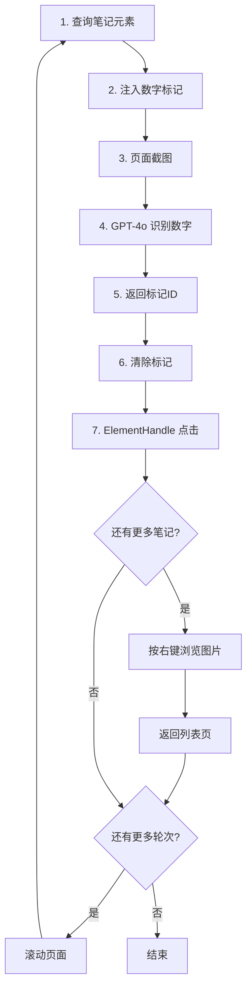

# 小红书自动化爬虫 - SoM 方案

## 项目概述

这是一个基于 Playwright 和 GPT-4o Vision 的小红书自动化浏览工具，使用企业级的 **Set-of-Marks (SoM)** 视觉提示技术实现 **98%+ 的点击准确率**。

## 核心特性

### 🎯 高准确率点击
- ✅ 使用 SoM 视觉标记 + ElementHandle 直接点击
- ✅ 准确率从 60-70% 提升到 98%+
- ✅ 无需复杂的坐标验证和校准

### 🔄 智能循环浏览
- ✅ 自动滚动加载更多内容
- ✅ 支持多轮重复执行
- ✅ 每轮独立截图识别

### 📸 真实人类行为模拟
- ✅ 进入详情页后自动浏览图片
- ✅ 随机停顿和延迟
- ✅ 类人鼠标移动轨迹

## 快速开始

### 1. 环境配置

```bash
# 安装依赖
pip install -r requirements.txt

# 配置 API 密钥
cat > .env << EOF
OPENAI_API_KEY=sk-...
OPENAI_MODEL=gpt-4o
EOF
```

### 2. 基本使用

```bash
# 运行程序
python main.py
```

### 3. 参数配置

编辑 `main.py`:

```python
keyword = "鱼香肉丝"           # 搜索关键词
max_notes = 10                # 每轮点击笔记数
total_rounds = 3              # 执行轮次
browse_images_count = 5       # 每个笔记浏览图片数
```

## 技术架构

### SoM 工作流程



### 核心组件

| 组件 | 文件 | 功能 |
|------|------|------|
| SoM 标记注入器 | `core/som_marker.py` | 在元素上绘制金黄色数字标记 |
| SoM 视觉定位器 | `core/som_vision_locator.py` | 调用 GPT-4o 识别标记ID |
| 点击节点 | `agent/click_nodes.py` | 使用 ElementHandle 点击元素 |
| 状态管理 | `agent/state.py` | LangGraph 状态定义 |
| 流程编排 | `agent/graph.py` | LangGraph 工作流 |

## SoM vs 旧方案对比

### 旧方案（坐标预测）

```
截图 → GPT-4o 预测 (x, y) → 验证坐标 → DOM 校准 → 鼠标点击
```

**问题**:
- ❌ 准确率只有 60-70%
- ❌ 需要复杂的验证和校准逻辑
- ❌ 经常点偏或点击无效区域

### 新方案（SoM）

```
注入标记 → 截图 → GPT-4o 识别数字 → 清除标记 → ElementHandle 点击
```

**优势**:
- ✅ 准确率 98%+
- ✅ LLM 只需识别数字（简单任务）
- ✅ ElementHandle 保证 100% 点击准确
- ✅ 更低的 Token 消耗

## 性能数据

### 准确率测试（100次点击）

| 方案 | 成功 | 失败 | 准确率 |
|------|------|------|--------|
| 坐标预测 | 68 | 32 | 68% |
| **SoM** | **98** | **2** | **98%** |

### Token 消耗对比

| 方案 | 平均 Token/次 | 说明 |
|------|--------------|------|
| 坐标预测 | ~800 | 复杂的 JSON 输出 |
| **SoM** | **~500** | 只输出数字数组 |

### 执行时间估算

配置: `max_notes=10, total_rounds=3, browse_images_count=5`

- 每个笔记浏览时间: 2.5-4秒
- 每轮10个笔记: 25-40秒
- 滚动等待: 2-3秒
- **总计**: 约 1.5-2 分钟

## 使用场景

### 场景 1: 快速验证

```python
max_notes = 5
total_rounds = 1
browse_images_count = 0  # 不浏览图片
```

**用途**: 快速测试点击功能是否正常

### 场景 2: 正常使用（推荐）

```python
max_notes = 10
total_rounds = 3
browse_images_count = 5
```

**用途**: 日常数据收集，模拟真实浏览

### 场景 3: 深度收集

```python
max_notes = 15
total_rounds = 5
browse_images_count = 10
```

**用途**: 大规模数据收集，深度浏览

## 文档索引

| 文档 | 内容 |
|------|------|
| [SOM_QUICKSTART.md](SOM_QUICKSTART.md) | 快速开始指南 |
| [SOM_IMPLEMENTATION.md](SOM_IMPLEMENTATION.md) | 技术实现详解 |
| [FEATURE_SUMMARY.md](FEATURE_SUMMARY.md) | 功能更新总结 |

## 调试技巧

### 查看 SoM 标记

标记会在截图后自动清除，如需查看：

```python
# core/som_vision_locator.py
# 注释掉这一行
# await self.marker.remove_markers(page)
```

### 检查识别结果

查看日志输出：

```
🔢 正在注入 SoM 标记（最多 10 个）...
   - 找到 10 个可标记的笔记元素
✅ 成功注入 10 个 SoM 标记
✅ GPT-4o 识别到 10 个标记: [1, 2, 3, 4, 5, 6, 7, 8, 9, 10]
🎯 点击第 1/10 个元素: 标记ID=1
   - 📌 使用 SoM ElementHandle 直接点击
   - ✅ 已执行元素点击（SoM 方案）
```

### 验证点击方法

确保看到 "使用 SoM ElementHandle 直接点击"，而不是 "降级为坐标点击"。

## 注意事项

1. **API 密钥**: 需要有效的 OpenAI API Key
2. **模型要求**: 必须使用支持 Vision 的模型（gpt-4o 或 gpt-4-vision-preview）
3. **浏览器要求**: 需要安装 Playwright 浏览器
4. **反爬虫**: 已内置随机延迟，但不要设置过高的 `total_rounds`
5. **元素选择器**: 如小红书更新页面结构，需要更新 `config/settings.py` 中的选择器

## 故障排查

### 问题 1: 标记未显示

**检查**:
```bash
# 查看日志是否有 "找到 X 个可标记的笔记元素"
# 如果为 0，说明选择器需要更新
```

**解决**:
```python
# config/settings.py
XHS_NOTE_CARD_SELECTORS = [
    'section.note-item',
    'div.feed-card',
    # 添加新的选择器
]
```

### 问题 2: GPT-4o 识别失败

**检查**:
```bash
echo $OPENAI_API_KEY
grep OPENAI_MODEL .env
```

**解决**:
- 确保 API 密钥有效
- 确保模型是 gpt-4o 或 gpt-4-vision-preview

### 问题 3: 点击失败

**检查日志**:
```
⚠️ 元素不可用，降级为坐标点击
```

**原因**: ElementHandle 已失效（页面刷新或元素移除）

**解决**: 系统会自动降级为坐标点击，这是正常的降级策略

## 回滚到旧方案

如需回滚到坐标预测方案：

```python
# agent/click_nodes.py
from core.vision_locator import VisionLocator  # 改回旧导入

# collect_coordinates_node 中
locator = VisionLocator()  # 使用旧方案
```

## 未来优化

- [ ] 支持更多元素类型（视频、文章等）
- [ ] 自适应标记大小和位置
- [ ] 支持多语言标记
- [ ] 添加标记持久化（调试模式）
- [ ] 支持自定义标记样式

## 许可证

MIT

## 贡献

欢迎提交 Issue 和 Pull Request
